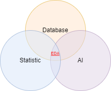

# Definition of EDA

## Definition of EDA

- **EDA** allows identifying systematic relationships between variables when there are no a priori hypotheses (or incomplete hypotheses) about the nature of these relationships.
- During a typical exploratory analysis, the researcher considers and compares many variables using various techniques to highlight systematic structures.
- A discipline situated at the intersection of statistics, artificial intelligence, and databases.

**EDA is often confused with statistical data analysis, but these disciplines differ:**

| **Statistics** | **EDA** |
|----------------|---------|
| Statistical analysis has a long scientific history. | Data mining emerged more recently from computer science. |
| Statistical analysis techniques are often used to prove or disprove a hypothesis based on a limited set of data. | EDA techniques are generally applied to large datasets. |
| Statistical analysis requires formulating a research hypothesis whose validity is tested by performing statistical tests on a dataset specifically collected for this purpose. These data provide evidence supporting the posed hypothesis. | EDA allows extracting unknown knowledge and relationships from the analysis of a dataset. |

## Steps of EDA

1. **Data**
2. **Preprocessing**
3. **Transformation**
4. **Analysis**
5. **Visualization and Interpretation**
6. **Knowledge Extraction**
