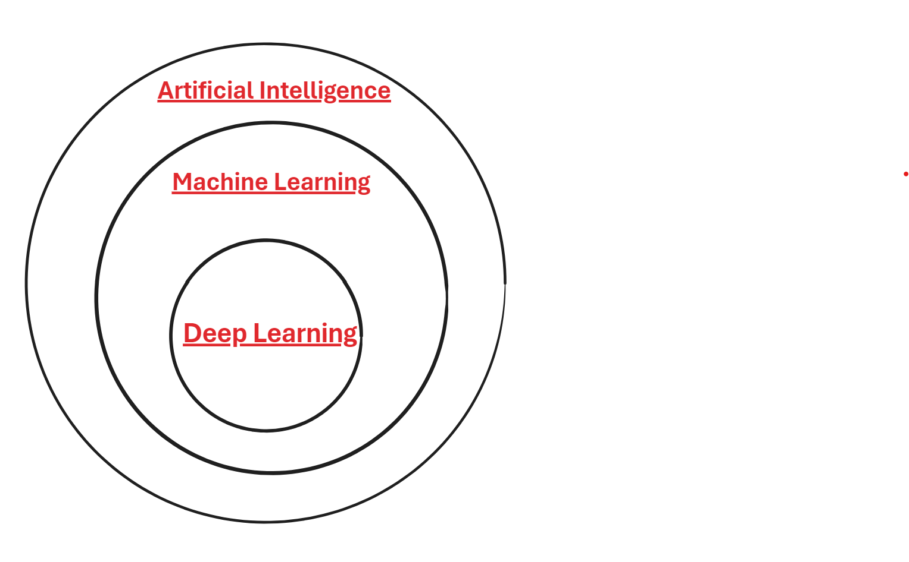

# 2. Artificial Intelligence VS Machine Learning VS Deep Learning

This section explains the differences between Artificial Intelligence (AI), Machine Learning (ML), and Deep Learning (DL).

---

## Artificial Intelligence (AI)

AI is a broad field that encompasses many different technologies and applications.

### Key Characteristics of AI

- **Learning**: The ability to acquire and apply knowledge.
- **Reasoning**: The ability to solve problems through logical deduction.
- **Self-correction**: The ability to adapt and improve over time.

### Historical Context

- The term "artificial intelligence" was coined in 1956 by pioneering thinkers who believed that machines could "think" like humans.
- There were technological developments in a field called "the science and engineering of making intelligent machines," but this was followed by the AI winter around 1975 due to several failures.
- AI was based on explicit rules of the type If...Then...
- **Examples**: Chatbots, expert systems.

---

## Machine Learning (ML)

**Machine Learning (ML)** is a subset of AI that focuses on developing algorithms that allow computers to learn from data and make predictions or decisions based on that data.

### Key Characteristics of ML

- **Data-Driven**: Relies on large datasets to train models.
- **Adaptive**: Improves performance over time based on available data.
- **Predictive**: Capable of making predictions or decisions based on patterns found in the data.

### Why Machine Learning?

- Typical computer programs accomplish tasks using explicit instructions provided by a programmer. However, some tasks are difficult to solve with an explicit sequence of instructions. For example, recognizing pathologies from medical images requires implicit understanding.
- Machine learning algorithms perform specific tasks using data rather than explicit instructions. To do this, they build a mathematical model based on data, called "training data," which includes the desired inputs and outputs.

### Key Differences

- In ML, the machine learns from data.
- In AI, the system is given preprogrammed rules.

### Examples of Machine Learning Algorithms

- SVM (Support Vector Machines)
- Regression models
- Neural networks

---

## Deep Learning (DL)

**Deep Learning (DL)** is a specialized subset of machine learning that uses artificial neural networks with many layers (hence "deep") to analyze various types of data.

### Key Characteristics of DL

- **Neural Networks**: Utilizes artificial neural networks with multiple layers (deep networks).
- **High Performance**: Capable of handling and analyzing large amounts of data, leading to superior performance on complex tasks.
- **Feature Learning**: Automatically discovers the representations needed for feature detection or classification from raw data.

### Structure of Deep Learning

- The learning process is called deep because the structure of artificial neural networks consists of multiple input, output, and hidden layers.
- Each layer contains units that transform input data into information that the next layer can use for a specific predictive task.
- Through this structure, a machine can learn through its own data processing.

### Applications of Deep Learning

- **Image Recognition**: Identifying objects, people, and scenes in images.
- **Speech Recognition**: Converting spoken language into text.
- **Natural Language Processing**: Understanding and generating human language.
- **Autonomous Vehicles**: Enabling self-driving cars to recognize and respond to their environment.

---

---
