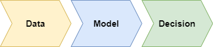

# 3. Machine Learning Paradigm

## Definition of Machine Learning

Machine learning is a set of methods that allow constructing a model of reality from data, either by improving an existing less general model or by creating a new model representative of new data.

- **Model of Reality**: The construction of the model depends on the data to be analyzed. The parameters of the model are determined during the learning phase using a specific algorithm.
- **Decision Making**: Models are used to make decisions based on the provided data.

## Data

The term "data" is defined in different ways in the literature depending on the fields and areas of application.

Data is:
- **Record**: A record characterized by a set of fields (database terminology).
- **Individual**: An individual defined by a set of characteristics, parameters, or variables (statistical terminology).
- **Instance**: An instance characterized by a set of attributes (object-oriented terminology in computer science).
- **Point or Vector**: A point or vector characterized by its coordinates in a vector space (algebraic terminology).

Data is generally represented in the form of a matrix with $N$ rows representing individuals and $K$ columns corresponding to variables. We denote $M$ as the matrix of dimension $(N, K)$ containing the data.

## Decision

From the input data, we will make decisions. The decision to be made depends essentially on the machine learning problem to be solved.

### Examples of Decision Making

- **Medicine**: Deciding whether or not to perform surgery on a patient.
- **Chess**: Deciding whether or not to move a pawn in a chess game.

Data implies the decision to be made. The decision is made by a type of model.

## Model

A model is the function that allows returning a decision based on input data (training data).

### Importance of the Model

- **Model Determination**: Determining the model is a crucial step in machine learning.
- **Types of Models**: There are several possible models in the literature, among which we can cite the Bayes model and neural networks.

---
