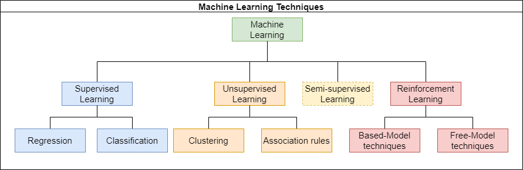

# 4. Machine Learning Techniques

## Hierarchical Diagram of Learning Types

## Supervised Learning

In the case of supervised learning, the system observes input-output pairs and learns a function (a model) that maps the input to the output.
- This phase is called the learning or training phase. In this sense, the learning is called supervised, a metaphor meaning that a teacher teaches the system the output to provide for each input.
- The input data and the corresponding output data (also called classes or target variables) are known (also referred to as labeled).
- They are grouped into a dataset called training data, which is presented as pairs \((x_i, y_i)\) with \(i < N\) and \(N\) being the number of samples.

### Applications of Supervised Learning

- **Computer Vision**: Detecting a pathology in an X-ray image.
- **Pattern Recognition**: Facial recognition.
- **Pattern Classification**: In finance and banking for credit card fraud detection (fraud, no fraud).
- **Handwriting Recognition**: Identifying postal codes.
- **Speech Recognition**: Customer authentication.
- **Natural Language Processing**: Translation.

## Unsupervised Learning

Contrary to supervised learning, in the case of unsupervised learning, the output data are not known (they are not labeled).
- The system learns on its own to organize the data or determine structures within the data.
- The most common learning task is clustering, which involves grouping the input data based on their common characteristics.
- This type of learning is used for data visualization or exploration.

### Example of Unsupervised Learning

Some smartphones use unsupervised learning to automatically organize photos. The phone can identify the same person in photos or find similar locations to sort them based on these criteria, which is clustering based on certain criteria.

### Applications of Unsupervised Learning

- **Data Partitioning**: For example, with the k-means algorithm, hierarchical clustering.
- **Density Estimation**.
- **Dimensionality Reduction**: Principal Component Analysis (PCA), self-organizing maps.

## Semi-Supervised Learning

Semi-supervised learning is based on a mix of labeled and unlabeled data.
- It lies between supervised learning, which uses only labeled data, and unsupervised learning, which uses only unlabeled data.

### Why Semi-Supervised Learning?

- Data labeling often requires human intervention. When datasets become very large, this operation can be costly, repetitive, and time-consuming.
- Semi-supervised learning, which only requires a few labeled samples, has a clear practical advantage.

## Reinforcement Learning

Reinforcement learning is based on input data similar to those used in supervised learning.
- However, in this case, learning is guided by the environment in the form of rewards (positive or negative) calculated based on the error made during learning.

### Techniques of Reinforcement Learning

- **Model-Based Techniques**: These methods use a model of the environment to make decisions.
  - **Examples**: Planning methods, Model Predictive Control (MPC).
- **Model-Free Techniques**: These methods do not use a model of the environment.
  - **Examples**: Q-Learning, Deep Q-Network (DQN), Policy Gradient Methods.

### Examples of Reinforcement Learning

- **Robotics**: A robot that adapts its way of walking depending on the state of the ground.
- **Control**: A robot that learns to keep a stick in unstable balance, another that flips pancakes.

---

Thank you for reviewing this module on machine learning techniques. For any questions or suggestions, you can contact me at [ryan.naidji@gmail.com](mailto:ryan.naidji@gmail.com).
