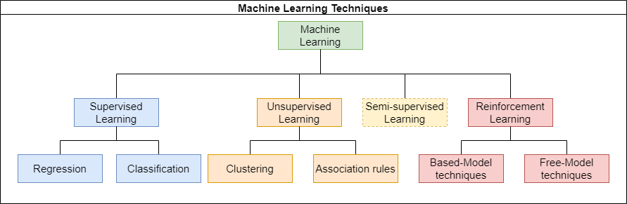

# Machine Learning Techniques

In this document, we will explore different machine learning techniques with a focus on supervised learning. The diagram below illustrates the different categories of machine learning techniques.

## Supervised Learning

Supervised learning involves training a model on labeled data. This means that each training example is paired with an output label. The goal is to learn a mapping from inputs to outputs that can be used to predict labels for new, unseen data.

### Types of Supervised Learning

1. **Regression**: Used when the output variable is a continuous value. The goal is to predict a numerical value given an input.
   - **Examples**: Predicting house prices, forecasting stock prices.

2. **Classification**: Used when the output variable is a categorical value. The goal is to predict a discrete label given an input.
   - **Examples**: Spam detection, image recognition.

## Unsupervised Learning

Unsupervised learning involves training a model on data without labeled responses. The goal is to infer the natural structure present within a set of data points.

### Examples of Unsupervised Learning

1. **Clustering**: Grouping a set of objects such that objects in the same group are more similar to each other than to those in other groups.
   - **Examples**: Customer segmentation, grouping similar news articles.

2. **Association Rules**: Discovering interesting relations between variables in large databases.
   - **Examples**: Market basket analysis, recommendation systems.
